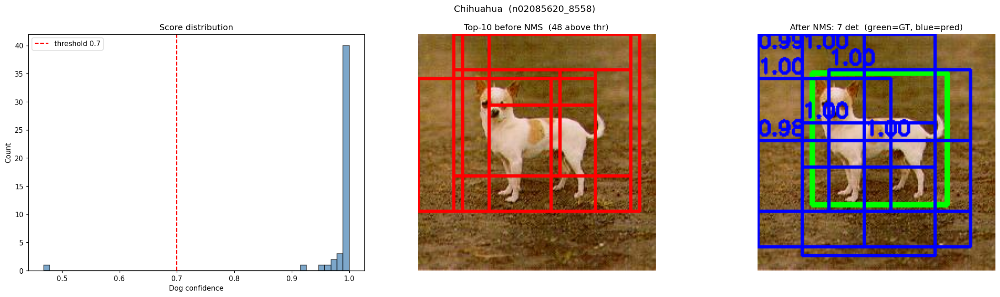
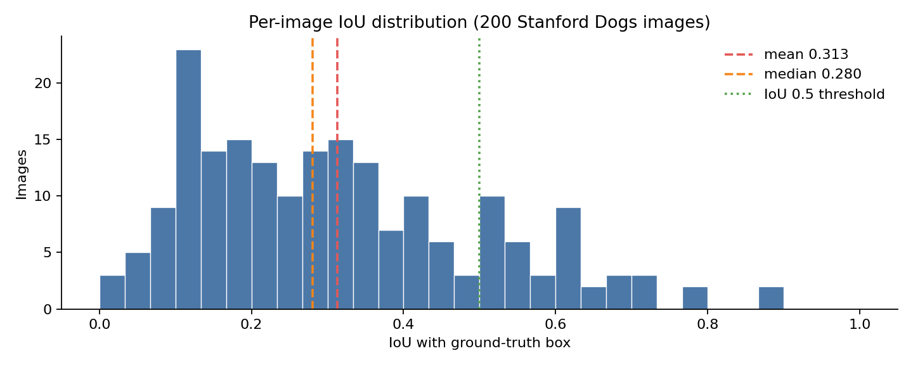
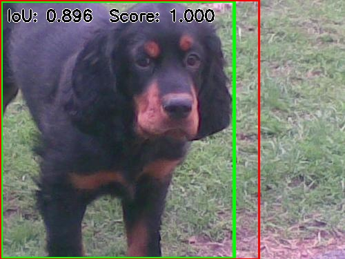
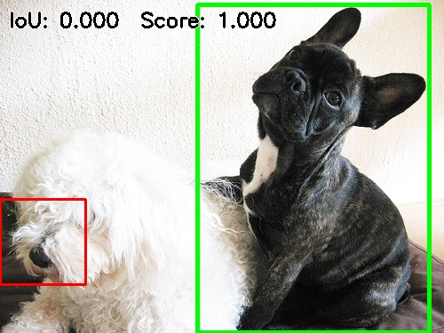

# ResNet50 Sliding-Window Dog Detector

A 2 phase computer vision pipeline: train and compare three dog-vs-cat classifiers, then reuse the strongest one (unmodified) as a from scratch object detector that localizes dogs in full scenes and is scored with IoU against ground truth boxes.

No detection head, no bounding box regression, no anchor boxes. The only learned component is a binary image classifier. Localization comes entirely from classical computer vision (image pyramid, sliding window, non-maximum suppression). The interesting result is how far that it got me and exactly where it breaks.

```
 Dogs-vs-Cats images
        │
        ▼
 ┌──────────────────────────┐
 │  3 competing classifiers │   HOG + SVM  /  PCA + SVM  /  ResNet50 (transfer learning)
 └──────────────────────────┘
        │  best model: ResNet50
        ▼
 ┌──────────────────────────┐
 │  patch → dog-confidence  │   classifier wrapped in a score_patches() interface
 └──────────────────────────┘
        │
        ▼
 image pyramid + sliding window ──▶ threshold ──▶ NMS ──▶ IoU vs. Stanford Dogs GT boxes
```


## Classification

Three approaches, same train/test split:

| Method | Accuracy | Training time | Hardware |
|---|---|---|---|
| HOG + linear SVM | 64.64% | ~10 min | CPU |
| PCA ("eigendogs") + RBF SVM | 68.61% | ~2 min | CPU |
| **ResNet50, progressive unfreeze + augmentation** | **99.66%** | ~12 min | GPU |

The hand-engineered feature pipelines land ~65–69%, barely above the coin-flip baseline for this task. Transfer learning closes the gap almost entirely, which is what makes the detection phase viable at all — a sliding-window detector inherits its precision directly from the patch scorer.


## Detection & localization

The fine-tuned classifier is wrapped in a `score_patches()` interface and reused, as-is, as a detector:

1. **Image pyramid** — scale factor 1.25, down to a 128px minimum side.
2. **Sliding windows** — square windows of `{96, 128, 160, 192}` px per pyramid level, stride 32, each resized to 224×224 before scoring.
3. **Threshold + NMS** — keep patches scoring ≥ 0.7, then greedy non-maximum suppression at IoU 0.4.

Left to right: the distribution of dog-confidence scores over all candidate windows, the top-scoring candidates before NMS, and the surviving boxes after suppression (green = ground truth, blue = prediction).

<p>
  
</p>

Evaluated on 200 images from the [Stanford Dogs dataset](http://vision.stanford.edu/aditya86/ImageNetDogs/), scored with `resnet50_noaug.pth`:

| Metric | Value |
|---|---|
| Mean IoU | 0.313 |
| Median IoU | 0.280 |
| IoU ≥ 0.5 | 20.0% |
| IoU ≥ 0.3 | 47.0% |

<p>
  
</p>

The distribution is interesting. The classifier is near-perfect at deciding a patch contains a dog, but the detector is only loosely right about where. Most predictions cluster in the 0.1–0.4 band, the dog is found, the box is sloppy.

Best and worst cases from the run (green = ground truth, red = prediction):

<p>
  
  
</p>

The failure on the right is the characteristic one: 2 dogs in frame, and since the detector returns only its top-1 box, a confident lock onto the wrong animal scores 0.000 IoU despite the classifier being entirely correct.

Main failure modes: scale mismatch (dogs too small or too large for any pyramid level), cluttered backgrounds producing false positives, multiple dogs in frame (top-1 box only), unusual poses and occlusion, and elongated ground-truth boxes that no square window can fit.

Sample outputs live in `outputs/`: `detector_demo/` (candidate → threshold → NMS visualizations), `qualitative/` (success / borderline / failure cases), `best_worst/` (top and bottom 5 IoU predictions), and `per_image_iou_results.csv` (full per-image results).

## Project structure

```
dog_detector.ipynb               # full pipeline: classification, detection, evaluation
run_localization_eval.py         # headless runner for just the detection + IoU eval cells
export_best_worst_qualitative.py # renders GT/prediction overlays for the best/worst IoU cases
resnet50_noaug.pth               # trained classifier weights used by the detector pipeline
outputs/                         # qualitative and quantitative evaluation artifacts
requirements.txt
```

## Running it

```bash
pip install -r requirements.txt
```

- Open `dog_detector.ipynb` for the full walkthrough (classifier training + comparison, then detection + evaluation).
- `python run_localization_eval.py` runs just the detection/IoU-evaluation cells against the included `resnet50_noaug.pth` checkpoint, skipping classifier training.
- `python export_best_worst_qualitative.py` regenerates the best/worst overlay images in `outputs/best_worst/` from `outputs/per_image_iou_results.csv`.

Expects a `data/` directory (not included, due to size) with a Kaggle-style `data/train/train/`, `data/test/test/` dogs-vs-cats split and `data/stanford_dogs/` (images + PASCAL-VOC XML annotations) for the detection phase.

## Tech stack

Python, PyTorch / torchvision, OpenCV, scikit-learn, scikit-image, NumPy, pandas, matplotlib.

## Attribution

This began as a team project for a university computer vision course, with the classification phase built collaboratively. I built the detection half — Stanford Dogs ingestion and annotation parsing, candidate generation, patch scoring, NMS, and the IoU evaluation, which is why this repo is centered on the detector.
